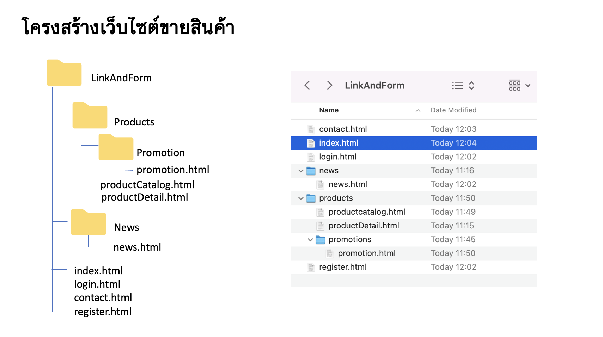
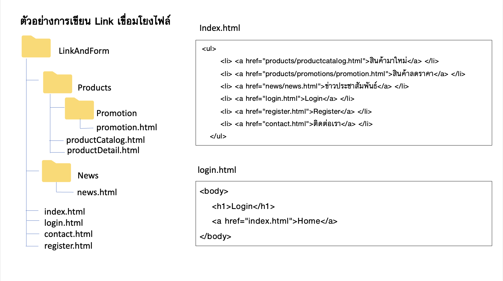

# Link 

## Relative Path and Absolute Path

## ตัวอย่างโครงสร้างไฟล์



### Absolute Path :การอ้างอิงตำแหน่งไฟล์ จากตำแหน่งที่เก็บจริงใน Drive
การอ้างอิงตำแหน่งไฟล์จริงตามที่เก็บใน drive ตามตัวอย่างโครงสร้างไฟล์ เช่น ไฟล์เก็บไว้ใน folder c:/>week3LinkandForm/
- c:/>LinkandForm/contact.html
- c:/>LinkandForm/products/productCatalog.html
- c:/>LinkandForm/index.html

**ข้อเสีย การอ้างอิงระบุตำแหน่งไฟล์จริง ทำให้เมื่อมีการย้ายตำแหน่งการเก็บไฟล์ ต้องตามแก้ไขทุกครั้ง**

### Relative Path : การอ้างอิงตำแหน่งไฟล์ จากไฟล์ปัจจุบันที่กำลังทำงานอยู่ ไปยังตำแหน่งไฟล์ปลายทาง 

การอ้างอิงให้คำนึงถึงไฟล์ที่กำลังทำงานปัจจุบัน  พิจารณาเส้นทางเข้าถึงไฟล์ปลายทาง เช่น ต้องการสร้างลิงค์ จากไฟล์ index.html ไปยังไฟล์ productCatalog.html เขียนคำสังได้ดังนี้
```
<a href=“products/productCatalog.html”> สินค้ามาใหม่ </a>
```
หรือต้องการสร้างลิงค์จากไฟล์ index.html ไปยังไฟล์ login.html

```
<a href=login.html”> Login </a>
```

เนื่องจากไฟล์ index.html และ login.html เก็บอยู่ในตำแหน่งเดียวกัน สามารถเรียกชื่อไฟล์ได้เลย
ถ้าเก็บอยู่คนละ folder ให้ใช้สัญลักษณะ /เพื่อเปิดไปยัง folder ที่ไฟล์นั้นเก็บอยู่ตามลำดับชั้นของ folder 

กรณีที่ไฟล์ต้องการเชื่อมโยงไปยังไฟล์ อยู่ด้านนอก folder ที่กำลังทำงานอยู่ ต้องใช้สัญลักษณะ ../ หมายถึงการเดินออกจาก folder ปัจจุบันขึ้นมา 1 ระดับ เช่น ต้องการเชื่อมโยงไฟล์ news.html กลับไปยังไฟล์ index.html
```
<a href=“../index.html”> Home </a>
```





## Contact

Pattaraporn Warintarawej

31 Moo 6 Makamtai District, Muang, Surat Thani, Thailand 84000<br>
Faculty of Sciences and Industrail Technology<br>
Prince of Songkla University, Surat Thani Campus


